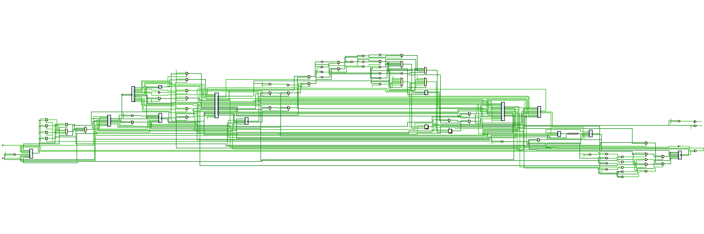

# 实验报告：流水线竞争的处理

<div style="text-align:center">
    王艺杭<br>
    2023202316
</div>
本实验实现了一个支持 MIPS 指令集的 5 级流水线 CPU。为了保证流水线的正确执行并尽可能提高性能，必须妥善处理数据冒险（Data Hazards）和控制冒险（Control Hazards）。以下是本 CPU 对这些竞争情况的具体处理方案。



## 数据冒险 (Data Hazards)

数据冒险发生在当前指令需要使用之前指令尚未写入寄存器堆的数据时。本设计主要通过**转发（Forwarding）**和**暂停（Stall）**两种机制来解决。

### 转发机制 (Forwarding)

转发机制允许将流水线后级（MEM 或 WB 阶段）产生的数据直接传递给前级（EX 或 ID 阶段），而无需等待数据写回寄存器堆。

#### EX 阶段转发 (ALU-ALU Forwarding)
由 `forwarding_unit.v` 实现，用于解决 R 型或 I 型运算指令之间的数据依赖。
*   **EX Hazard (相邻指令依赖)**: 当 MEM 阶段指令（上一条指令）将写入寄存器，且写入目标与当前 EX 阶段指令的源寄存器（Rs 或 Rt）相同时，将 MEM 阶段的 ALU 结果直接转发给 EX 阶段的 ALU 输入。
    *   优先级：最高（因为是最新的数据）。
*   **MEM Hazard (相隔一条指令依赖)**: 当 WB 阶段指令（上上条指令）将写入寄存器，且写入目标与当前 EX 阶段指令的源寄存器相同时，将 WB 阶段的写回数据转发给 EX 阶段。
    *   注意：只有当 EX Hazard 不存在时才启用 MEM Hazard 转发（Double Data Hazard 处理）。

#### Store 指令的数据转发
对于 `sw` 指令，需要存储的数据来自 Rt 寄存器。在 `pipline_cpu.v` 中，Store 数据使用了与 ALU 输入 B 相同的转发逻辑 (`alu_in_b_temp`)。这确保了即使 `sw` 指令紧跟在修改其存储数据的指令之后，也能正确写入最新的值。

#### ID 阶段转发 (Branch Forwarding)
为了减少分支延迟，本 CPU 将分支判断逻辑提前到了 ID 阶段。因此，必须将数据转发到 ID 阶段。
*   **来源**: MEM 阶段的运算结果/加载数据 (`mem_forward_data`) 或 WB 阶段的写回数据 (`wb_write_data`)。
*   **逻辑**: 如果前序指令的目标寄存器与分支指令的源寄存器相同，则直接选用转发数据进行比较。
*   **Load-Use 优化**: 由于数据存储器设计为异步读，MEM 阶段的 Load 指令结果可以在当个周期直接转发给 ID 阶段的分支单元，无需额外的暂停。

### 暂停机制 (Stall) - Load-Use Hazard

当一条指令需要使用上一条 Load 指令读取的数据进行运算时（Load-Use 冒险），数据在 EX 阶段尚未准备好（Load 结果在 MEM 阶段产生），无法通过 EX 阶段转发解决。

*   **检测**: `hazard_detection_unit.v` 检测到 ID/EX 寄存器（上一条指令）的 `MemRead` 信号有效，且其目标寄存器与当前 ID 阶段指令的源寄存器（Rs 或 Rt）冲突。
*   **处理**:
    
    1.  **冻结 PC**: `pc_write = 0`，保持当前取指地址不变。
    2.  **冻结 IF/ID**: `if_id_stall = 1`，保持当前解码指令不变。
    3.  **冲刷 ID/EX**: `id_ex_flush = 1`，向 EX 阶段插入一个气泡（NOP），确保错误的控制信号不会向下传递。
    *   结果：流水线暂停一个周期，下一周期 Load 指令进入 MEM 阶段，数据即可通过转发机制获得。

## 控制冒险 (Control Hazards)

控制冒险主要由分支（Branch）和跳转（Jump）指令引起，导致 PC 值改变，流水线中已预取的指令可能无效。

### 分支预测与延迟槽 (Delay Slot)

本 CPU 实现了 MIPS 标准的**延迟槽**机制。
*   **策略**: 无论分支是否发生，紧跟在分支/跳转指令后的一条指令（位于延迟槽中）总是会被执行。
*   **实现**: 当检测到分支跳转发生时 (`branch_taken = 1`)，**不冲刷** IF/ID 寄存器 (`if_flush = 0`)，允许延迟槽指令正常进入流水线执行。

### 提前分支判断

为了降低分支预测失败的代价（虽然使用了延迟槽，但尽早确定目标地址总是好的），分支比较和目标地址计算被提前到了 **ID 阶段** (`branch_unit`)。
*   这意味着分支指令在 ID 阶段即可决定下一条 PC 是 `PC+4` 还是跳转目标，无需等待到 EX 或 MEM 阶段。

### 延迟槽中的控制指令竞争 (Control Hazard in Delay Slot)

这是一个特殊的边界情况：如果汇编代码在分支指令的延迟槽中放置了另一条跳转指令（例如 `beq ...; j loop`），且第一条分支成立。
*   **问题**: 标准 MIPS 规定此行为未定义。若不处理，第二条跳转指令可能会覆盖第一条分支的目标，导致程序流错误。
*   **解决方案**: 
    1.  在 `id_ex_reg` 中增加 `branch_taken` 信号的传递，将“上一条指令是否发生了跳转”的状态传递给 EX 阶段 (`ex_branch_taken`)。
    2.  在 ID 阶段计算当前指令的 `actual_branch_taken` 时，加入抑制逻辑：
        ```verilog
        assign actual_branch_taken = branch_taken && !ex_branch_taken;
        ```
    3.  **效果**: 如果上一条指令（现处于 EX 阶段）已经发生了跳转，说明当前指令位于延迟槽中。此时强制抑制当前指令的跳转能力，将其视为普通指令执行，从而确保第一条分支的跳转目标生效。

通过上述对数据冒险和控制冒险的全面处理，本 CPU 能够正确、高效地执行复杂的指令序列，并通过了包含大量数据依赖和控制流跳转的测试用例。
